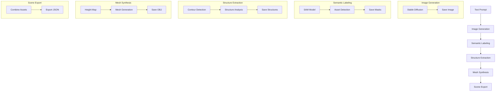

```mermaid
graph TD
    A[Text Prompt] --> B[Image Generation]
    B --> C[Semantic Labeling]
    C --> D[Structure Extraction]
    D --> E[Mesh Synthesis]
    E --> F[Scene Export]

    subgraph "Image Generation"
        B1[Stable Diffusion] --> B2[Save Image]
    end

    subgraph "Semantic Labeling"
        C1[SAM Model] --> C2[Asset Detection]
        C2 --> C3[Save Masks]
    end

    subgraph "Structure Extraction"
        D1[Contour Detection] --> D2[Structure Analysis]
        D2 --> D3[Save Structures]
    end

    subgraph "Mesh Synthesis"
        E1[Height Map] --> E2[Mesh Generation]
        E2 --> E3[Save OBJ]
    end

    subgraph "Scene Export"
        F1[Combine Assets] --> F2[Export JSON]
    end
``` 